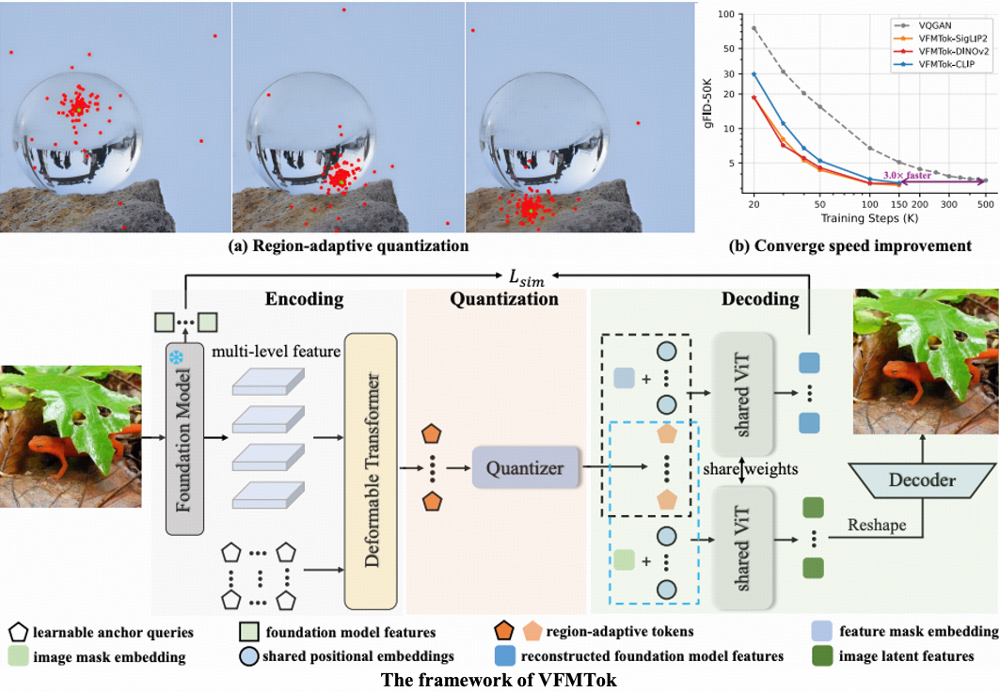

<!-- # VFMTok-RAR
(NeurIPS 2025, SOTA) Vision Foundation Models as Effective Visual Tokenizers for Autoregressive Image Generation -->
# Vision Foundation Models as Effective Visual Tokenizers for Autoregressive Generation <br><sub>SOTA performance</sub>

[](https://arxiv.org/pdf/2507.08441)&nbsp;
[](https://huggingface.co/yexiguafu/VFMTok)&nbsp;


<p align="center">

<p>

<!-- This is a PyTorch/GPU implementation of the paper **Vision Foundation Models as Effective Visual Tokenizers for Autoregressive Generation**, dubbed as **VFMTok**, which achieve state-of-the-art (SOTA) performance (gFID: 1.33, gIS: 317.4) for the task of class-to-image generation based on [RAR](https://yucornetto.github.io/projects/rar.html). **VFMTok is the first** to experimentally demonstrate that features from existing vision foundation models (such as DINOv2, SigLIP, SigLIP2, etc.) can be directly leveraged to reconstruct the original image. To achieve this, VFMTok innovatively designed two key components: (1) a **region-adaptive quantization** framework that reduces redundancy in the pre-trained features on regular 2D grids, and (2) a semantic reconstruction objective that aligns the tokenizer’s outputs with the foundation model’s representations to preserve semantic fidelity. Once the trained VFMTok is integrated into the autoregressive (AR) generative models, it achieves notable results on the class-to-image generation task, while accelerating convergence by a factor of three. Besides, it also enables high-fidelity class-conditional synthesis **without the requirement of a CFG (classifier-free guidance)**. -->

This is a PyTorch/GPU implementation of the paper **"Vision Foundation Models as Effective Visual Tokenizers for Autoregressive Generation"**, referred to as VFMTok, which establishes **new state-of-the-art performance (gFID: 1.33, gIS: 317.4)** for class-to-image generation based on the [RAR](https://yucornetto.github.io/projects/rar.html) framework.

VFMTok presents **the first experimental evidence** that features from existing pre-trained vision foundation models (including DINOv2, SigLIP, SigLIP2, etc.) can be directly utilized to reconstruct original images. To accomplish this, VFMTok introduces two innovative components: (1) a **region-adaptive quantization** framework that minimizes redundancy in pre-trained features on standard 2D grids, and (2) a **semantic reconstruction objective** that aligns the tokenizer's outputs with the foundation model's representations to maintain semantic fidelity.

When integrated into the AR generative models, the trained VFMTok achieves remarkable performance in class-to-image generation while tripling the convergence speed. Additionally, it enables high-fidelity class-conditional synthesis **without requiring classifier-free guidance (CFG)**.

This repo contains:

* 🪐 A simple PyTorch implementation of VFMTok and various RAR generative models.
* ⚡️ Pre-trained tokenizer: VFMTok and AR generative models trained on ImageNet.
* 🛸 Training and evaluation scripts for tokenizer and generative models, which were also provided in [here](./scripts).
* 🎉 Hugging Face for easy access to pre-trained models.


## Release

- [2024/07/11] 🔥 **VFMTok** has been released. Checkout the [paper](https://arxiv.org/pdf/2507.08441) for details.🔥
- [2025/09/18] 🔥 **VFMTok has been accepted by NeurIPS 2025!** 🔥
- [2025/10/11] 🔥 [Image tokenizers](https://huggingface.co/yexiguafu/VFMTok/tree/main/DINOv2/tokenizer) and [AR models](https://huggingface.co/yexiguafu/VFMTok/tree/main/DINOv2) for class-conditional image generation are released. 🔥
- [2025/10/11] 🔥 All codes of VFMTok have been released. 🔥

## Contents
- [Install](#install)
- [Model Zoo](#model-zoo)
- [Performance](#performance)
- [Train](#train)
- [Evaluation](#evaluation)

## Install

If you are not using Linux, do *NOT* proceed.

1. Clone this repository and navigate to Hita folder
```bash
git clone https://github.com/CVMI-Lab/VFMTok.git
cd VFMTok
```

2. Install Package
```Shell
conda create -n vfmtok python=3.10 -y
conda activate vfmtok
pip install --upgrade pip  # enable PEP 660 support
pip install -e .
```

3. Install additional packages for training cases as required.
```
pip install -e ".[train]"
pip install flash-attn --no-build-isolation
```
4. Install deformable attention module
```
cd vfmtok/modules/ops
bash make.sh
```
## Model Zoom

In this repo, we release:
* One image tokenizers: **VFMTok(DINOv2)**.
* State-of-the-art class-conditional autoregressive generative models ranging from **461M** to **1.5B** parameters.

### 1. VQ-VAE models
In this repo, we release one image tokenizer: VFMTok(DINOv2). It directly utilizes the features from the frozen pre-trained VFM -- DINOv2, to reconstruct the image. Besides, VFMToks also designs 2 key components: **region-adaptive quantization** and **semantic reconstruction** to reduce the redundancy in the pretrained features and maintain the semantic fidelity, respectively.

Method | tokens | rFID (256x256) | rIS (256x256)    | weight
---    | :---:  |:---:|:---:   | :---: 
VFMTok |  256   | 0.98 | 216.2   | [vfmtok-tokenizer.pt](https://huggingface.co/yexiguafu/VFMTok/blob/main/DINOv2/tokenizer/vfmtok-tokenizer.pt)

### 2. AR generation models with classifier-free guidance (CFG).
Once the trained VFMTok(DINOv2) is integrated into autoregressive (AR) generative models, it ahieves notable image generation performance.

Method   | params | epochs | FID | sFID |  IS  | Pre. | Rec. |
---      | :---:  | :---:  | :---:| :---: |:---: | :---:|:---:|
VFMTok-L |  461M  |  400   | 1.33 | 5.72 | 317.4 | 0.78 | 0.65 |

### 3. AR generation without CFG (CFG-free image generation).
The trained VFMTok(DINOv2), when integrated into the AR generation models, can also achieve impressive image generation quality without CFG-guidance (CFG-free guidance).

Method   | params | epochs | FID | sFID |  IS  | Pre. | Rec. |
---      | :---:  | :---:  | :---:| :---: |:---: | :---:|:---:|
VFMTok-L |  461M  |  400   | 2.01 | 5.34 | 211.1 | 0.78 | 0.63 |


## Training

### 1. Preparation

1. Download the [DINOv2-L](https://dl.fbaipublicfiles.com/dinov2/dinov2_vitl14/dinov2_vitl14_reg4_pretrain.pth) pre-trained foundation model from the official [model zoo](https://github.com/facebookresearch/dinov2).
2. Create symbolic links that point from the locations of the pretrained DINOv2-L model and the ImageNet training dataset folders to this directory.
3. Create dataset script for your own dataset. Here, we provide a template for training tokenizers and AR generative models using the ImageNet dataset in [LMDB](https://www.symas.com/mdb) format.

```bash
ln -s DINOv2-L_folder init_models
ln -s ImageNetFolder imagenet
```

### 2.VFMTok Training

1. Training VFMTok(DINOv2) tokenizer (see ```scripts/tokenizer/train_tok.sh```):

```bash
export NODE_COUNT=1
export NODE_RANK=0
export PROC_PER_NODE=8
scripts/autoregressive/torchrun.sh vq_train.py  --image-size 336 --results-dir output --mixed-precision none --codebook-slots-embed-dim 12    \
    --data-path imagenet/lmdb/train_lmdb --global-batch-size 8 --num-workers 4 --ckpt-every 5000 --epochs 50 \
    --transformer-config configs/vit_transformer.yaml --log-every 1 --lr 1e-4 --ema --z-channels 512 \
```

### 3. AR generative model training

1. Training AR generative models (see ```scripts/autoregressive/run_train.sh```)

```bash
config_file='configs/training/generator/rar.yaml'
accelerate launch --config_file $1 train_rar.py --config-file ${config_file} --image-size 336 --anno-file imagenet/lmdb/train_lmdb --num-workers 4
```

2. Resume from an AR generative checkpoint
```bash
config_file='configs/training/generator/rar.yaml'
accelerate launch --config_file $1 train_rar.py --config-file ${config_file} --image-size 336 --anno-file imagenet/lmdb/train_lmdb --num-workers 4
```

### 4. Evaluation (ImageNet 256x256)

1. Evaluated a pretrained tokenizer (see ```scripts/tokenizer/run_tok.sh```):

```bash
scripts/autoregressive/torchrun.sh vqgan_test.py --vq-model VQ-16 --image-size 336 --output_dir recons --batch-size $1   \
        --z-channels 512 --vq-ckpt tokenizer/vfmtok-tokenizer.pt --codebook-slots-embed-dim 12
```

2. Evaluate a pretrained AR generative model (see ```scripts/autoregressive/run_test.sh```)

```bash
config_file='configs/training/generator/rar.yaml'
iters="checkpoint-$(printf "%06d" "$1")"
scripts/autoregressive/torchrun.sh test_net.py --config-file ${config_file} --compile \
     --gpt-ckpt snapshot/RAR-L/${iters}/model.safetensors --image-size 256 --image-size-eval 256 --per-proc-batch-size $2 \
     --guidance-scale $3 --sample-dir samples --guidance-scale-pow 1
```
## Citation

If you find VFMTok useful for your research and applications, please kindly cite using this BibTeX:
```
@article{zheng2025vision,
  title={Vision Foundation Models as Effective Visual Tokenizers for Autoregressive Image Generation},
  author={Zheng, Anlin and Wen, Xin and Zhang, Xuanyang and Ma, Chuofan and Wang, Tiancai and Yu, Gang and Zhang, Xiangyu and Qi, Xiaojuan},
  journal={arXiv preprint arXiv:2507.08441},
  year={2025}
}
```

## License
The majority of this project is licensed under Apacha 2.0 License. Portions of the project are available under separate license of referred projects, detailed in corresponding files.


## Acknowledgement

Our codebase builds upon several excellent open-source projects, including [LlamaGen](https://github.com/FoundationVision/LlamaGen), [Deformable DETR](https://github.com/fundamentalvision/Deformable-DETR), [VFMTok](https://github.com/CVMI-Lab/VFMTok), [RAR](https://github.com/bytedance/1d-tokenizer) and [AliTok](https://github.com/ali-vilab/alitok). We are grateful to the communities behind them.

## Contact
This codebase has been cleaned up but has not undergone extensive testing. If you encounter any issues or have questions, please open a GitHub issue. We appreciate your feedback!